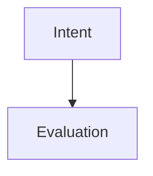

# Flow Writer

A Tauri-based application for editing context engineering documents with XML structure, Markdown content, and Mermaid flow diagrams.

## Features

- **XML Document Parsing**: Parse context documents with meta, variables, sections, and flow graphs
- **Variable Substitution**: Dynamic `${varName}` variable resolution throughout sections
- **Mermaid Flow Diagrams**: Parse and render flowchart diagrams with click actions
- **Flat Section Structure**: Simple, non-nested section organization for clarity
- **Async Processing**: Efficient async loading of documents and flow graphs
- **Schema Validation**: XML Schema (XSD) validation for document integrity (planned)

## Architecture

### Design Documentation

- **[Frontend Architecture](knowledge-docs/architecture/frontend-md-section-block-architecture.md)** - React/CodeMirror integration (v2.0 - Flat sections)
- **[XML Schema Validation](knowledge-docs/architecture/xml-schema-validation-design.md)** - Schema validation design
- **[Tauri Middleware](knowledge-docs/architecture/tauri-middleware-architecture.md)** - Backend architecture
- **[XML Schema (XSD)](knowledge-docs/schemas/context-document.xsd)** - Schema definition

### Backend (Rust/Tauri)

The backend is built with Rust and Tauri, providing fast, secure native capabilities:

- **Models**: Data structures for documents, sections, flow graphs, and metadata
- **Parsers**: XML and Mermaid parsing engines
- **Processors**: Variable resolution and content processing
- **Services**: Async document loading and processing services
- **Tauri Commands**: Exposed APIs for frontend integration
- **Validators**: XML schema validation (planned)

### Frontend (React)

The frontend uses React with CodeMirror for editing markdown sections with flat structure (no nesting).

## Setup

### Prerequisites

- **Node.js** (v18 or higher)
- **pnpm** (recommended) or npm
- **Rust** (latest stable)
- **Tauri CLI**

### Installation

1. **Clone the repository**:
   ```bash
   git clone <repository-url>
   cd flow-writer
   ```

2. **Install frontend dependencies**:
   ```bash
   pnpm install
   ```

3. **Install Rust dependencies** (automatically handled by Cargo):
   ```bash
   cd src-tauri
   cargo build
   ```

## Development

### Run the application in development mode:

```bash
pnpm tauri dev
```

This will:
- Start the Vite dev server for the React frontend
- Compile and run the Rust backend
- Open the application window

### Build for production:

```bash
pnpm tauri build
```

## Testing

### Run all tests (unit + integration):

```bash
cd src-tauri
cargo test
```

**Test Summary**:
- **55 total tests** covering models, parsers, validators, processors, services, and integration
- **Unit tests**: Test individual components in isolation
- **Integration tests**: Test complete workflows
- **Schema validation tests**: Test XML structure enforcement
- **Example file test**: Validates against `context-example.xml`

### Run specific test suites:

```bash
# Run only unit tests
cargo test --lib

# Run only integration tests
cargo test --test integration_test

# Run test with example file
cargo test --test test_with_example_file

# Run schema validation tests specifically
cargo test schema_validator

# Run with output
cargo test -- --nocapture
```

### Test XML Schema Validation

The schema validator enforces structural rules before parsing:

```bash
# Test that valid documents pass
cargo test test_valid_document

# Test that nested sections are rejected
cargo test test_nested_section_rejected

# Test that invalid section types are caught
cargo test test_invalid_section_type

# Test all validation rules
cargo test schema_validator -- --nocapture
```

**What Schema Validation Catches:**
- ❌ Nested sections (all sections must be flat)
- ❌ Invalid section types (only `intent`, `evaluation`, `process`, `alternatives` allowed)
- ❌ Duplicate section IDs
- ❌ Missing required elements (`meta`, `variables`, `sections`)
- ❌ Sections without `id`, `type`, or `content`

**Example validation error:**
```
Schema validation failed: Section 'parent-1' contains nested sections.
Section nesting is not allowed - all sections must be direct children of <sections>.
```

### Test Coverage

- ✅ **Models** (15 tests): Data structure serialization and validation
- ✅ **XML Parser** (5 tests): Meta, variables, sections, flow parsing
- ✅ **Mermaid Parser** (6 tests): Node, edge, and click action parsing
- ✅ **Variable Resolver** (8 tests): Variable substitution in sections
- ✅ **Schema Validator** (8 tests): XML structure validation and error handling
- ✅ **Flow Service** (7 tests): Async document loading and processing
- ✅ **Integration** (5 tests): End-to-end workflows and error handling
- ✅ **Example File** (1 test): Full validation with `context-example.xml`

## Project Structure

```
flow-writer/
├── src/                    # React frontend source
├── src-tauri/              # Rust backend
│   ├── src/
│   │   ├── models/         # Data models
│   │   │   ├── document.rs
│   │   │   ├── section.rs
│   │   │   └── flow_graph.rs
│   │   ├── parsers/        # Parsers
│   │   │   ├── xml_parser.rs
│   │   │   └── mermaid_parser.rs
│   │   ├── validators/     # Schema validation
│   │   │   └── schema_validator.rs
│   │   ├── processors/     # Content processors
│   │   │   └── variable_resolver.rs
│   │   ├── services/       # Business logic
│   │   │   └── flow_service.rs
│   │   ├── error.rs        # Error handling
│   │   └── lib.rs          # Tauri commands
│   ├── tests/              # Integration tests
│   │   ├── integration_test.rs
│   │   └── test_with_example_file.rs
│   ├── context-docs/       # Example documents
│   │   └── context-example.xml
│   └── Cargo.toml
├── package.json
└── README.md
```

## API Reference

### Tauri Commands

The following commands are exposed to the frontend:

#### `load_sections(file_path: string) -> Vec<Section>`
Loads all sections from the context document with resolved variables.

```typescript
import { invoke } from '@tauri-apps/api/core';

const sections = await invoke('load_sections', {
  filePath: '/path/to/context.xml'
});
```

#### `load_flow_graph(file_path: string) -> Option<FlowGraph>`
Loads and parses the flow graph with enriched node references.

```typescript
const flowGraph = await invoke('load_flow_graph', {
  filePath: '/path/to/context.xml'
});
```

#### `load_metadata(file_path: string) -> MetaData`
Loads document metadata (title, author, tags, etc.).

```typescript
const metadata = await invoke('load_metadata', {
  filePath: '/path/to/context.xml'
});
```

## XML Document Format

Example context document structure:

```xml
<?xml version="1.0" encoding="UTF-8"?>
<context version="1.0">
  <meta>
    <title>Document Title</title>
    <author>Author Name</author>
    <created>2025-10-09</created>
    <app name="CEC" version="0.1.0"/>
    <tags>tag1, tag2, tag3</tags>
    <description>Document description</description>
  </meta>

  <variables>
    <var name="userName">Jeremy</var>
    <var name="goal">Ship v1</var>
  </variables>

  <sections>
    <section id="intent-1" type="intent">
      <content><![CDATA[
# Intent
We aim to **${goal}** for **${userName}**.
      ]]></content>
    </section>
  </sections>

  <flow id="flow-1" version="1.0">
    <title>Document Flow</title>
    <diagram><![CDATA[

    ]]></diagram>
  </flow>
</context>
```

## Dependencies

### Backend (Rust)
- `tauri` - Desktop application framework
- `serde` - Serialization/deserialization
- `quick-xml` - Fast XML parsing
- `roxmltree` - XML schema validation
- `regex` - Pattern matching for Mermaid
- `tokio` - Async runtime
- `thiserror` - Error handling

### Frontend (React)
- React - UI framework
- Vite - Build tool
- CodeMirror - Code editor (planned)
- TailwindCSS - Styling (planned)

## Contributing

1. Fork the repository
2. Create a feature branch
3. Write tests for new functionality
4. Ensure all tests pass: `cargo test`
5. Submit a pull request

## License

[Add your license here]

## Author

Jeremy Lu

