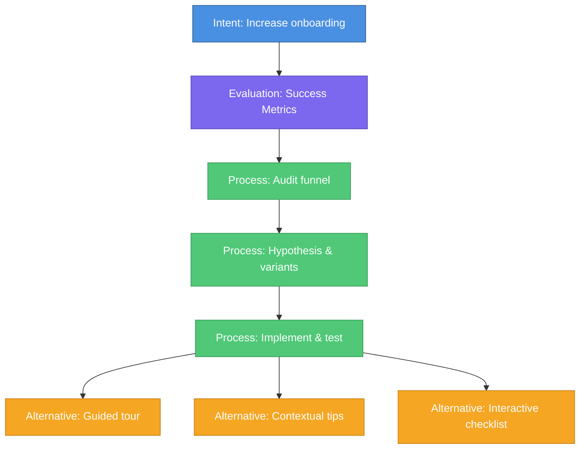

# 🧭 Context Engineering Framework — Front-End Design

_Last updated: 2025-10-06 (local)_


A modular system to help professionals design and evaluate **context‑engineered tasks** — clearly defining intent, evaluation criteria, process flow, and alternative strategies. **Flow diagrams are represented using Mermaid syntax**.

---

## 🧩 Core Sections

| Layer | Focus | Example Keywords | Type | Suggested Name |
|------|-------|------------------|------|----------------|
| 1️⃣ | User goal / intent | ask, goal, purpose, objective | declarative | **Intent** |
| 2️⃣ | Output quality definition | success, criteria, evaluation | evaluative | **Evaluation** |
| 3️⃣ | Step‑by‑step execution | tasks, phases, methods | sequential (serial) | **Process** |
| 4️⃣ | Parallel alternatives | options, choices, approaches | parallel | **Alternatives** |

> **Canonical flow:** `Intent → Evaluation → Process → Alternatives`  
> Placement is flexible: **Alternatives** can appear between Intent and Evaluation; **Process** can appear between Intent and Evaluation; **Alternatives** can nest within **Process** steps and vice‑versa.

---

## 💻 Front-End Architecture

- **Framework:** React (shared for Web + Desktop)
- **Desktop Shell:** **Tauri** (Rust backend; lightweight; smaller memory and faster startup than Electron in most apps)
- **Language:** **JavaScript/JSX** (using React hooks and functional components)
- **Styling:** **Radix UI** primitives + **CSS/SCSS** + **Emotion** (styled components). Radix is styling‑agnostic and accessible.
- **Editor (Markdown):** **CodeMirror 6** via `@uiw/react-codemirror` (per‑block editor instances)
- **Preview (Markdown):** **react-markdown**
- **XML Parsing:** **fast-xml-parser** (robust, fast)
- **UI Primitives for Annotations:** **Radix UI** (Popover, DropdownMenu, Dialog)
- **State Management:** **zustand** (lightweight, simple state management)

---

## ✍️ Block-by-Block Markdown Editing (Obsidian-style)

- **One CodeMirror instance per “block”** (cell). Blocks can span multiple lines/sections.
- **Side‑by‑side view:** left = editor (CodeMirror), right = preview (react-markdown).
- **Per‑block annotation affordances:** a subtle “⋯” button or right‑click opens a **Radix Popover/Dropdown** with actions:
  - _Revise_, _Change tone_, _Check spelling/grammar_, _Query this block_, _Custom prompt…_ (Dialog with textarea).
- **Block operations:** split, merge, reorder (drag‑handle), duplicate, delete.
- **XML anchors:** each block can be associated with an XML node `id` to bind structure ↔ content.

---

## 🧠 Data Structure: Single Markdown File with Frontmatter + Mermaid

The system uses a **single Markdown file** with YAML frontmatter for metadata and Mermaid for flow diagrams.

### Document Structure

```markdown
---
version: 1.0
title: Increase Onboarding Completion
created: 2025-10-06
modified: 2025-10-06
---

# Intent

Increase onboarding completion rate by improving the user experience during first-time setup.

**Goals:**
- Achieve 85% completion rate within 30 days
- Reduce time-to-first-value to under 5 minutes

---

# Evaluation

## Success Criteria

- [ ] Completion rate >= 85% in 30 days
- [ ] Time-to-first-value <= 5 min
- [ ] User satisfaction score >= 4.5/5

---

# Process

## Phase 1: Audit current funnel

Analyze existing onboarding flow to identify drop-off points...

## Phase 2: Hypothesis & variants

Develop multiple approaches based on funnel analysis...

## Phase 3: Implement & test

Build variants and run A/B tests to validate hypotheses...

---

# Alternatives

## Option 1: Guided tour

Interactive step-by-step walkthrough...

## Option 2: Contextual tips

Just-in-time hints that appear when needed...

## Option 3: Interactive checklist

Progress-based checklist with gamification...

---

# Flow Diagram


```

### Parsing Strategy

The markdown file is parsed into blocks/sections:

1. **Frontmatter** (YAML) - Document metadata
2. **H1 sections** - Top-level sections (Intent, Evaluation, Process, Alternatives)
3. **H2/H3+ subsections** - Nested content within sections
4. **Mermaid code block** - Flow diagram (identified by ```mermaid fence)

### Section Identification

Sections are identified by H1 headers with standard names:
- `# Intent` - User goals and objectives
- `# Evaluation` - Success criteria and metrics
- `# Process` - Step-by-step execution (H2s are phases)
- `# Alternatives` - Parallel options (H2s are individual alternatives)
- `# Flow Diagram` - Contains the Mermaid diagram

### Benefits of Single Markdown File

- **Simplicity:** Everything in one file, easy to version control
- **Portability:** Standard markdown format, works with any editor
- **Human-readable:** No XML overhead, just clean markdown
- **Git-friendly:** Text-based, easy to diff and merge
- **Self-contained:** Metadata, content, and diagram all in one place

---

## 🔌 Rendering & Data Flow

1. **Load** Markdown file → parse with custom parser:
   - Extract YAML frontmatter (metadata)
   - Split by H1 headers to identify sections
   - Extract Mermaid code block from "Flow Diagram" section
   - Build section objects with type, title, content, subsections
2. **Render UI**:
   - Block Editor: One CodeMirror editor per section
   - Each section edits its portion of the markdown
   - Preview: live preview via `react-markdown`
   - Annotations: Radix Popover/Dropdown per block; Dialog for custom prompts
3. **Save**:
   - Reconstruct markdown from sections
   - Preserve frontmatter (update modified date)
   - Write back to single file
4. **Diagram View**:
   - Render Mermaid diagram using `mermaid.js`
   - Make diagram nodes clickable to navigate to corresponding section
   - Highlight active section in diagram
   - Support diagram editing (edit Mermaid text directly in Flow Diagram section)

---

## 📦 NPM Libraries Summary

- **Editor**: `@uiw/react-codemirror`, `@codemirror/lang-markdown`
- **Markdown Preview**: `react-markdown`, `remark-gfm` (tables, strikethrough)
- **Markdown Parsing**: `gray-matter` (frontmatter), `remark` + `remark-parse` (AST parsing)
- **Diagram Rendering**: `mermaid`
- **UI Primitives**: `@radix-ui/react-popover`, `@radix-ui/react-dropdown-menu`, `@radix-ui/react-dialog`, `@radix-ui/themes`
- **Styling**: `sass` (SCSS), `@emotion/react`, `@emotion/styled`
- **State Management**: `zustand` for document state and UI state
- **Desktop APIs**: `@tauri-apps/api` for filesystem operations

---

## 🧪 Data Structure Examples (JavaScript)

```js
// Parsed document structure
const document = {
  metadata: {
    version: '1.0',
    title: 'Increase Onboarding Completion',
    created: '2025-10-06',
    modified: '2025-10-06'
  },
  sections: [
    {
      type: 'intent',
      title: 'Intent',
      content: 'Increase onboarding completion rate...',
      subsections: []
    },
    {
      type: 'evaluation',
      title: 'Evaluation',
      content: '',
      subsections: [
        {
          title: 'Success Criteria',
          content: '- [ ] Completion rate >= 85%...'
        }
      ]
    },
    {
      type: 'process',
      title: 'Process',
      content: '',
      subsections: [
        { title: 'Phase 1: Audit current funnel', content: '...' },
        { title: 'Phase 2: Hypothesis & variants', content: '...' },
        { title: 'Phase 3: Implement & test', content: '...' }
      ]
    },
    {
      type: 'alternatives',
      title: 'Alternatives',
      content: '',
      subsections: [
        { title: 'Option 1: Guided tour', content: '...' },
        { title: 'Option 2: Contextual tips', content: '...' },
        { title: 'Option 3: Interactive checklist', content: '...' }
      ]
    }
  ],
  mermaidDiagram: 'graph TD\n  INTENT[Intent]:::intent --> EVAL[Evaluation]:::evaluation...'
};

// Section type constants
const SectionType = {
  INTENT: 'intent',
  EVALUATION: 'evaluation',
  PROCESS: 'process',
  ALTERNATIVES: 'alternatives',
  FLOW_DIAGRAM: 'flow_diagram'
};
```

---

## ✅ Why Single Markdown File Works Well Here
- **Simplicity**: No XML overhead, just plain markdown
- **Version control**: Single file is easy to track with git
- **Human-readable**: Can be edited in any text editor or IDE
- **LLM-friendly**: Markdown is widely understood by AI models
- **Portable**: Standard format, no custom schema to maintain
- **Self-contained**: Metadata (frontmatter) + content + diagram in one place
- **Diff-friendly**: Text-based format shows clean diffs in git
- **No external files**: Everything in one place, no broken references

---

---

## 🚀 Implementation Phases

### Phase 1: Foundation & Dependencies

**Goal:** Install required packages and set up basic infrastructure

**Tasks:**
1. Install missing NPM packages:
   - `gray-matter` - YAML frontmatter parsing
   - `remark` + `remark-parse` - Markdown AST parsing
   - `mermaid` - Diagram rendering
   - `@radix-ui/react-popover` - Annotation popovers
   - `@radix-ui/react-dropdown-menu` - Context menus
   - `@radix-ui/react-dialog` - Modal dialogs
   - `zustand` - State management
2. Create project directory structure:
   - `src/stores/` - Zustand stores
   - `src/utils/` - Markdown parsers, file I/O utilities
   - `src/data/` - Sample markdown files
3. Set up JSDoc comments for type hints (optional but recommended for JavaScript)

**Deliverables:**
- All dependencies installed
- Directory structure created
- Ready for data layer implementation

---

### Phase 2: Markdown Parsing & Data Layer

**Goal:** Build markdown parsing and file storage system

**Tasks:**
1. Create markdown parser utility (`src/utils/markdownParser.js`):
   - Parse frontmatter with gray-matter
   - Split content by H1 headers to identify sections
   - Detect section types (Intent, Evaluation, Process, Alternatives, Flow Diagram)
   - Extract Mermaid code block from Flow Diagram section
   - Parse subsections (H2/H3) within each section
   - Build section objects with type, title, content, subsections
2. Create markdown serializer (`src/utils/markdownSerializer.js`):
   - Reconstruct frontmatter (YAML)
   - Rebuild markdown from section objects
   - Update modified timestamp
   - Preserve formatting and structure
3. Create file I/O layer (`src/utils/fileOperations.js`):
   - Use Tauri filesystem APIs
   - Load markdown file
   - Save markdown file
   - File picker dialogs (open/save)
4. Create sample data:
   - Example markdown file with all sections and Mermaid diagram
5. Create zustand store (`src/stores/documentStore.js`):
   - Store metadata (frontmatter)
   - Store sections array
   - Store Mermaid diagram string
   - Store current file path
   - Actions: loadDocument, saveDocument, updateSection, updateMermaid

**Deliverables:**
- Markdown parser extracting all sections correctly
- Serializer rebuilding markdown from sections
- File I/O functional with Tauri
- Zustand store managing document state
- Sample markdown file for testing

---

### Phase 3: Core UI Refactor

**Goal:** Integrate markdown-driven architecture into existing block editor

**Tasks:**
1. Refactor App.jsx:
   - Replace hardcoded blocks with parsed sections from markdown
   - Wire up zustand store
   - Load markdown document on mount
   - Map sections to MarkdownBlock components
   - Add File menu (New, Open, Save, Save As)
2. Update MarkdownBlock.jsx:
   - Accept section object as prop (type, title, content, subsections)
   - Update section content in zustand store on edit
   - Display section type badge (Intent/Evaluation/Process/Alternatives)
   - Support editing subsections (H2/H3 content)
3. Add file operations:
   - Open markdown file dialog (Tauri file picker)
   - Save current document
   - Save As dialog
   - Create new document from template
4. Add basic error handling:
   - Markdown parsing errors
   - File I/O errors
   - Invalid section structure
   - Auto-save on interval

**Deliverables:**
- App loads from markdown file instead of hardcoded data
- Blocks display and edit sections from parsed markdown
- File open/save/save-as working
- Error states handled gracefully
- Auto-save functional

---

### Phase 4: Enhanced UI & Diagram Visualization

**Goal:** Add side-by-side layout, per-block annotations, and Mermaid diagram view

**Tasks:**
1. Add Mermaid diagram view:
   - Create diagram component using mermaid.js
   - Render Mermaid string from store
   - Make diagram nodes clickable (navigate to section)
   - Highlight active section in diagram
   - Add diagram editor (edit Mermaid text)
2. Add side-by-side layout option:
   - Create layout toggle (stacked vs side-by-side vs diagram)
   - Implement split pane view (editor left, preview right)
   - Make layout responsive
3. Implement per-block annotations:
   - Add Radix Popover with action menu
   - Actions: Revise, Change tone, Check grammar, Query block
   - Add Radix Dialog for custom prompts
   - Store annotation state in zustand
4. Enhance block operations:
   - Split block (divide markdown into two blocks)
   - Merge blocks (combine with next/previous)
   - Duplicate block
   - Drag-and-drop reordering (using react-dnd or similar)
5. Add visual section differentiation:
   - Color-coded borders/badges by section kind
   - Icons for Intent/Evaluation/Process/Alternatives
   - Section metadata display
   - Match colors with Mermaid diagram classes

**Deliverables:**
- Mermaid diagram rendering and interactive
- Diagram editor for Mermaid text
- Side-by-side editor/preview mode working
- Annotation UI functional (menus, dialogs)
- Advanced block operations implemented
- Visual section type indicators matching diagram

---

## 📋 Phase Summary

| Phase | Focus | Complexity | Duration Estimate |
|-------|-------|------------|-------------------|
| 1 | Dependencies & Setup | Low | 1-2 hours |
| 2 | XML & Data Layer | High | 4-6 hours |
| 3 | Core Integration | Medium | 3-4 hours |
| 4 | Enhanced UI & Diagrams | Medium-High | 5-7 hours |

**Total Estimated Time:** 13-19 hours of development

**Note:** Phase 4 now includes Mermaid diagram visualization, which was previously considered a separate phase.

---

_This document intentionally omits the backend (FastAPI + LangGraph) per your request and focuses on the front‑end and XML‑first design._
